# 🛡️ Drupal Accessibility Conformance Report (ACR) Generator


> **Turn your issue queue into a living compliance document.**

This toolkit automates the creation of "Evergreen" Accessibility Conformance Reports (ACR) by bridging the gap between active issue queues and compliance documentation. It extracts accessibility issues, analyzes them with AI, and generates valid **OpenACR YAML & JSON** files compatible with the [Section 508 ACR Editor](https://acreditor.section508.gov/).

---

## 📜 History & Philosophy

The concept of the **"Evergreen ACR"** was born from a frustration with the traditional compliance workflow. Historically, Accessibility Conformance Reports (ACRs/VPATs) were static documents, manually created once a year (or less), and often outdated the moment they were published. They failed to reflect the dynamic nature of modern software development.

This project aims to solve that by:
1.  **Bridging the Gap:** Directly connecting the "source of truth" (the issue queue) with the "compliance artifact" (the ACR).
2.  **Incentivizing Reporting:** If filing a bug automatically updates the compliance report, developers and users are more motivated to report detailed accessibility issues.
3.  **Democratizing Compliance:** By using open-source tools and local AI (Ollama), we remove the cost barriers to generating high-quality compliance documentation.
4.  **Standardization:** Adopting the **OpenACR** standard ensures that the data is machine-readable and interoperable with government tools.

---

## 🎯 Project Mission

The primary goal is to transform accessibility reporting from a static, annual snapshot into a dynamic, living process.

* **🌱 Evergreen Compliance:** Generate reports monthly that reflect the *actual* state of accessibility.
* **🔗 Incentivized Reporting:** Tie official compliance directly to the issue queue, encouraging detailed bug reporting.
* **🧠 Actionable Intelligence:** Move beyond "Pass/Fail" to identify specific versions, blockers, and remediation steps.
* **🔒 Privacy & Flexibility:** Support both cloud-based AI (Google Gemini) and local AI (Ollama) for privacy and zero-cost operations.

---

## 🔄 Workflow Architecture

This tool executes a 4-step pipeline to transform raw issue data into a Section 508-compliant report.

```mermaid
graph LR
    A[Drupal.org Issue Queue] -->|Step 1: Extract| B(Raw Issues CSV)
    B -->|Step 2: Summarize <br/> 🤖 Gemini/Ollama| C(AI Summaries CSV)
    C -->|Step 3: Consolidate <br/> 🤖 Gemini/Ollama| D(Consolidated CSV)
    D -->|Step 4: Generate| E[OpenACR YAML/JSON]
    
    style A fill:#f9f,stroke:#333,stroke-width:2px
    style E fill:#9f9,stroke:#333,stroke-width:2px
```



* **Extract:** Crawls Drupal.org for tickets tagged `accessibility`, `wcag`, and specific SC tags (e.g., `wcag111`, `wcag21`), capturing metadata.
* **Summarize:** Uses AI to analyze issue descriptions, determining the specific WCAG Success Criterion (e.g., 1.1.1) and writing professional "ACR Notes."
* **Consolidate:** Groups issues by WCAG criterion to determine overall conformance levels (e.g., partially-supports).
* **Generate:** Outputs valid OpenACR YAML and JSON files.

---

## 🚀 Installation

### Prerequisites
* Python 3.9+
* Ollama (Optional, for local AI)

### Quick Start

1. **Clone the repository**
   ```bash
   git clone https://github.com/your-org/acr-generator.git
   cd acr-generator
   ```

2. **Set up Virtual Environment**
   ```bash
   python -m venv venv
   source venv/bin/activate  # Windows: venv\Scripts\activate
   ```

3. **Install Dependencies**
   ```bash
   pip install -r requirements.txt
   ```

4. **Configure Environment**
   Create a `.env` file in the root directory:
   ```ini
   GEMINI_API_KEY=your_api_key_here  # Required if using Gemini backend
   ```

---

## 🛠️ Usage

The master script `run_acr.py` orchestrates the entire pipeline. Results are saved in date-stamped directories (e.g., `results/12-12-2025/`).

### Basic Command
Run the full pipeline using the default Google Gemini backend:
```bash
python run_acr.py --repo drupal
```

### Using Local AI (Ollama) 🦙
Run entirely locally to avoid API costs and keep data private:
```bash
python run_acr.py --repo drupal --ai-backend ollama --model gemma3:4b
```

### Command Line Arguments

| Argument | Type | Default | Description |
|----------|------|---------|-------------|
| `--repo` | String | None | The project ID to scrape (e.g., `drupal`, `ckeditor`). |
| `--step` | Integer | All | Run a specific step (1, 2, 3, or 4). |
| `--ai-backend` | String | `gemini` | Choose AI backend: `gemini` or `ollama`. |
| `--model` | String | None | Specific model name (e.g., `gemma3:4b`, `llama3`). |
| `--ai-backend` | String | `gemini` | Choose AI provider: `gemini` (Cloud) or `ollama` (Local). |
| `--model` | String | None | Specific model name (e.g., `llama3`, `gemini-1.5-pro`). |

---

## 📂 Step-by-Step Breakdown

### Step 1: Extract Issues
Scrapes the issue queue for raw data.
```bash
python run_acr.py --repo drupal --step 1
```
**Output:** `results/wcag-detailed-issues_YYYY-MM-DD.csv`

### Step 2: AI Summarization
Analyzes issue descriptions and comments to generate compliance notes.
```bash
python run_acr.py --step 2 --ai-backend gemini
```
**Output:** `results/wcag-issue-summaries_YYYY-MM-DD.csv`

### Step 3: Consolidate Findings
Groups individual issues by WCAG Success Criteria to form a "chapter" level view.
```bash
python run_acr.py --step 3
```
**Output:** `results/wcag-acr-consolidated_YYYY-MM-DD.csv`

### Step 4: Generate OpenACR
Converts the consolidated data into the final government-compliant YAML format.
```bash
python run_acr.py --step 4
```
**Output:** `results/drupal-openacr_YYYY-MM-DD.yaml`

---

## 📊 File Formats

| File | Description | Key Columns |
|------|-------------|-------------|
| **Detailed Issues** | Raw scraping data | Issue ID, Status, Priority, Component |
| **Summaries** | AI-enriched data | ACR Note, Developer Note, WCAG Assessment |
| **Consolidated** | Chapter-level data | WCAG SC, Conformance Level, Remarks |
| **OpenACR YAML** | Final Report | Nested YAML structure conforming to Section 508 |

---

## 🤝 Contributing

Contributions are welcome! Please follow these steps:

1. Fork the project.
2. Create your feature branch (`git checkout -b feature/AmazingFeature`).
3. Commit your changes (`git commit -m 'Add some AmazingFeature'`).
4. Push to the branch (`git push origin feature/AmazingFeature`).
5. Open a Pull Request.

---

## 📄 License

Distributed under the AGPL License. See `LICENSE` for more information.
